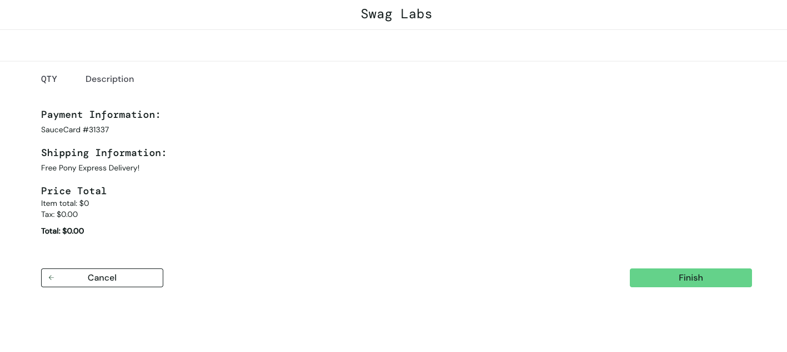
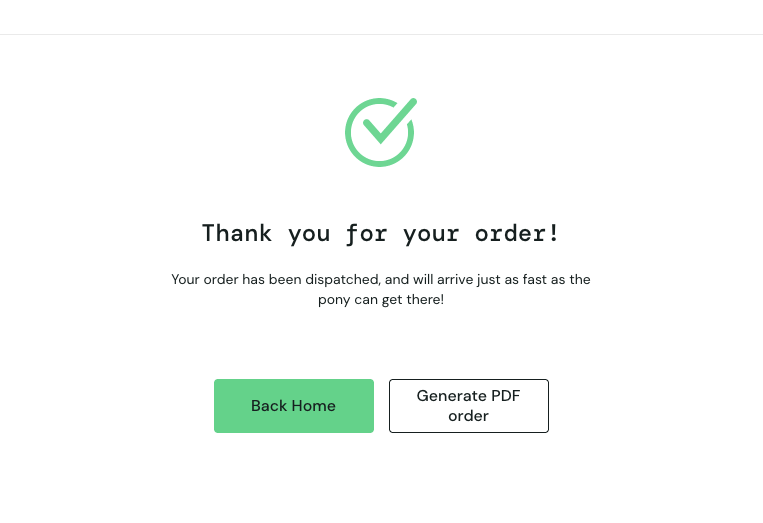
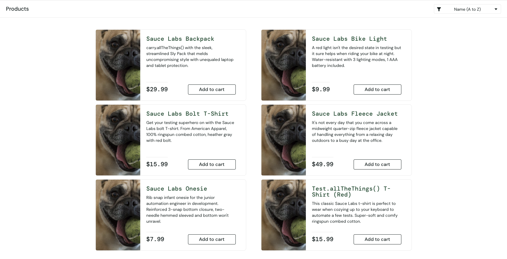
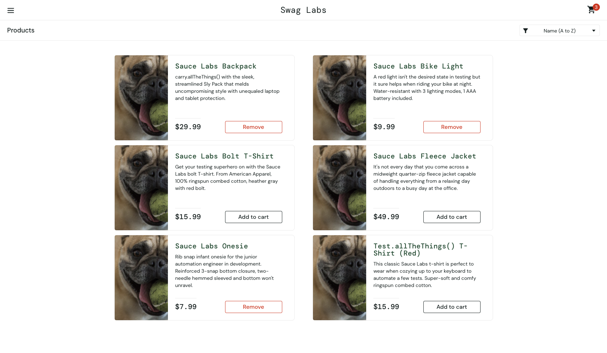
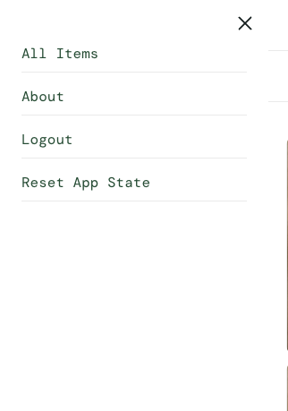
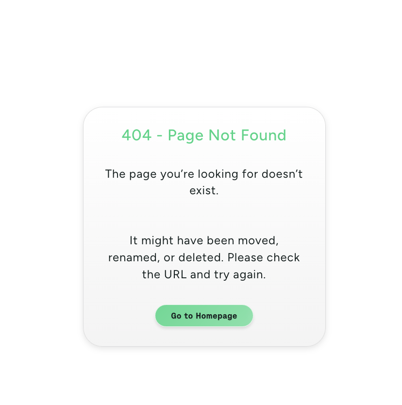

# Bugs

Session strategy: prioritized coverage of the highest-risk core flows first, login, adding items to cart, and checkout, since these are what every user must pass through to complete a purchase. On top of that scripted pass, each of the six seeded users (`locked_out_user`, `error_user`, `problem_user`, `performance_glitch_user`, `visual_user`) was run through the same core flow to catch any user-specific inconsistencies, which is how the `problem_user` bugs below were found along the way.

## BUG-001: Checkout completes and creates an order with an empty cart

**Environment:** Chrome (latest), macOS, 1699x1323 viewport

**Steps to Reproduce:**
1. Log in as `standard_user` / `secret_sauce`
2. Without adding any items (or after adding then removing an item), click the cart icon to open Your Cart
3. Click Checkout
4. Enter First Name, Last Name, Postal Code; click Continue
5. On Checkout: Overview, observe Item total: 0, Tax: 0.00, Total: 0.00 with no line items listed; click Finish

**Expected:** Checkout should be blocked when the cart has 0 items: either the Checkout button/flow is disabled, or Continue/Finish shows a validation error preventing an order from being placed for nothing.

**Actual:** The Overview page renders with a 0.00 total and no items, and clicking Finish still completes the order, showing "Thank you for your order!" on the confirmation page. No item, no payment, no validation, order still created.

**Severity:** S2: allows creation of invalid, meaningless orders (zero items, zero value) with no data validation on the core checkout transaction; not a security/data-loss issue, so not S1.

**Priority:** P2: undermines checkout data integrity and would pollute order records in a real system, but doesn't block the happy path for legitimate purchases, so it can be scheduled rather than hotfixed.

**Attachment:**

Overview page with 0.00 total and no items:

Order confirmed anyway:

## BUG-002: problem_user sees the wrong product image on every item

**Environment:** Chrome (latest), macOS, 1699x1323 viewport

**Steps to Reproduce:**
1. Log in as `problem_user` / `secret_sauce`
2. Land on the Products page

**Expected:** Each product card shows the image matching its own name/description (e.g. Sauce Labs Backpack shows a backpack, Sauce Labs Bike Light shows a bike light).

**Actual:** All six product cards show the same unrelated dog image instead of their actual product photo; every item on the Products page is affected.

**Severity:** S3: visual-only defect, no functional/data impact (add to cart, checkout, etc. still work), but it's wrong on every single product card.

**Priority:** P2: highly visible on the very first screen after login for this user and affects 100 percent of the catalog, so worth fixing soon even though nothing is functionally broken.

**Attachment:**

Products page for problem_user, all items showing the same wrong image:

## BUG-003: problem_user cannot remove some items from the Products page (works from the Cart page)

**Environment:** Chrome (latest), macOS, 1699x1323 viewport

**Steps to Reproduce:**
1. Log in as `problem_user` / `secret_sauce`
2. Add Sauce Labs Backpack, Sauce Labs Bike Light, and Sauce Labs Onesie to the cart (cart badge shows 3, all three buttons now read "Remove")
3. On the Products page, click "Remove" on one of the affected items (e.g. Sauce Labs Backpack)
4. Observe the button and cart badge do not update
5. Click the cart icon to open Your Cart, then click "Remove" on the same item there

**Expected:** Clicking "Remove" on the Products page removes the item from the cart and reverts the button to "Add to cart".

**Actual:** For added items, "Remove" on the Products page does nothing, the button stays "Remove" and the item stays in the cart. The same item can still be removed successfully from the Cart page, so there is a workaround and the user is not stuck.

**Severity:** S3: a real functional defect on the Products page, but a working alternate path exists (removal from the Cart page), so it doesn't block the user from completing their goal.

**Priority:** P3: annoying and inconsistent, but low impact given the workaround is one click away and discoverable; can be scheduled behind higher-impact fixes.

**Attachment:**

Products page for problem_user with items stuck on "Remove" (cart badge shows 3):

## BUG-004: problem_user cannot add some items to the cart from the Products page

**Environment:** Chrome (latest), macOS, 1699x1323 viewport

**Steps to Reproduce:**
1. Log in as `problem_user` / `secret_sauce`
2. On the Products page, click "Add to cart" on Sauce Labs Bolt T-Shirt, Sauce Labs Fleece Jacket, or Test.allTheThings() T-Shirt (Red), items still showing "Add to cart" (not yet in the cart)
3. Observe the button and cart badge do not update

**Expected:** Clicking "Add to cart" adds the item to the cart, the button changes to "Remove", and the cart badge count increases by one, same as it does for the other items.

**Actual:** For these items, "Add to cart" does nothing, the button stays "Add to cart" and the cart badge does not increase. Unlike BUG-003, no alternate path exists to add these items, since they can't reach the Cart page in the first place.

**Severity:** S2: a subset of the catalog is completely un-purchasable for this user, with no workaround; blocks the core add-to-cart action outright for affected items.

**Priority:** P2: directly blocks purchase of specific products for this user, but is scoped to one user type and doesn't affect the rest of the catalog or other users.

**Attachment:**

Products page for problem_user, unaffected items stuck on "Add to cart" while others already show "Remove":

## BUG-005: problem_user lands on a 404 page when clicking "About" in the sidebar

**Environment:** Chrome (latest), macOS, 1699x1323 viewport

**Steps to Reproduce:**
1. Log in as `problem_user` / `secret_sauce`
2. Open the sidebar menu
3. Click "About"

**Expected:** "About" navigates to the Sauce Labs marketing site (saucelabs.com) and loads a valid page.

**Actual:** The link leads to a "404: Page Not Found" screen with the message "The page you're looking for doesn't exist," offering only a "Go to Homepage" button.

**Severity:** S3: broken navigation on a secondary, non-transactional link; doesn't affect login, cart, or checkout functionality.

**Priority:** P3: low impact, "About" is not part of the core purchase flow and the dead end is easily escaped via "Go to Homepage" or browser back.

**Attachment:**

Sidebar menu with the "About" link:

Result after clicking "About":

## BUG-006: problem_user cannot type into the Last Name field on the Your Information page

**Environment:** Chrome (latest), macOS, 1699x1323 viewport

**Steps to Reproduce:**
1. Log in as `problem_user` / `secret_sauce`
2. Add an item to the cart, click the cart icon, then click Checkout to reach the Your Information page
3. Type a value into the First Name field
4. Click into the Last Name field and try to type a letter

**Expected:** The Last Name field accepts keyboard input independently of the First Name field, like the other checkout fields.

**Actual:** Typing a single letter into the Last Name field breaks it, no further characters can be entered; the field is effectively stuck and cannot be filled in. Since Last Name is required, this blocks the user from ever completing checkout, there is no workaround.

**Severity:** S1: hard blocker on the core checkout flow with no workaround for this user, a required field cannot be filled in, so no order can ever be placed.

**Priority:** P1: completely prevents purchase completion for this user; needs to be fixed immediately.

**Attachment:**

Screen recording reproducing the stuck Last Name field: [BUG-006-problem-user-last-name-overwrites-first-name.mov](bugs/attachments/BUG-006-problem-user-last-name-overwrites-first-name.mov)

## BUG-007: performance_glitch_user, Products page loads noticeably slower than other users

**Environment:** Chrome (latest), macOS, 1699x1323 viewport

**Steps to Reproduce:**
1. Log in as `performance_glitch_user` / `secret_sauce`
2. Observe the delay before the Products page becomes visible

**Expected:** Products page loads in a comparable time to other users

**Actual:** The Products page takes noticeably longer to load. 

**Severity:** S3: performance-only defect, the page does eventually load correctly and all functionality works once rendered, no data or navigation is broken.

**Priority:** P2: a 5+ second delay on the very first screen after login is a significant, user-visible degradation for this user and worth investigating even though it's not a hard blocker.

## BUG-008: error_user gets a 503 adding/removing some items from the cart

**Environment:** Chrome (latest), macOS, 1699x1323 viewport

**Steps to Reproduce:**
1. Log in as `error_user` / `secret_sauce`
2. On the Products page, click "Add to cart" on one of the affected items (not yet in the cart)
3. Separately, add a different affected item to the cart, then on the Products page click "Remove" on that item
4. Open DevTools > Network tab and inspect the requests triggered by each click
5. For the Remove case, click the cart icon to open Your Cart, then click "Remove" on the same item there

**Expected:** Both add and remove requests succeed and the button/cart state updates accordingly, same as for `standard_user`.

**Actual:** Both actions fail with a 503 response for the affected items. Add to cart: the item never enters the cart, the button stays "Add to cart", and there is no alternate path to add it, so those specific items cannot be purchased at all. Remove: the item stays in the cart when removing from the Products page, but the same item can still be removed successfully from the Cart page, so a workaround exists there. No error banner is shown to the user in either case.

**Severity:** S2: for the affected items, "Add to cart" has no workaround at all, it fully blocks the user from ever buying those specific products; the Remove side is less severe since a working alternate path exists via the Cart page.

**Priority:** P2: directly stops the user from buying specific items, even though it's scoped to one user type and part of the catalog remains unaffected.

**Attachment:**

Screen recording showing Remove failing on the Products page and succeeding from the Cart page: [BUG-008-error-user-remove-503-workaround-via-cart.mov](bugs/attachments/BUG-008-error-user-remove-503-workaround-via-cart.mov)